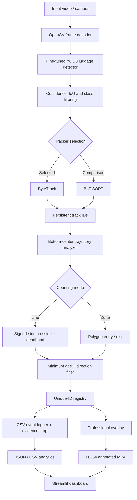

# System architecture

`detector.py` owns model inference; Ultralytics performs ByteTrack or BoT-SORT association and `tracker.py` normalizes results into a stable `Track` record. `counter.py` contains stateful line and polygon geometry. `visualization.py` owns presentation. Both command-line and Streamlit entry points call the same `process_video` implementation, so controls and exported evidence use the tested pipeline.

A detection is not a count. A track must reach the configured minimum age and its bottom-center must move between stable sides of the line (outside the deadband) or cross the polygon boundary. The accepted direction then enters a permanent counted-ID set, preventing the same tracker ID from incrementing the total twice. CSV and snapshots make every accepted event auditable.
