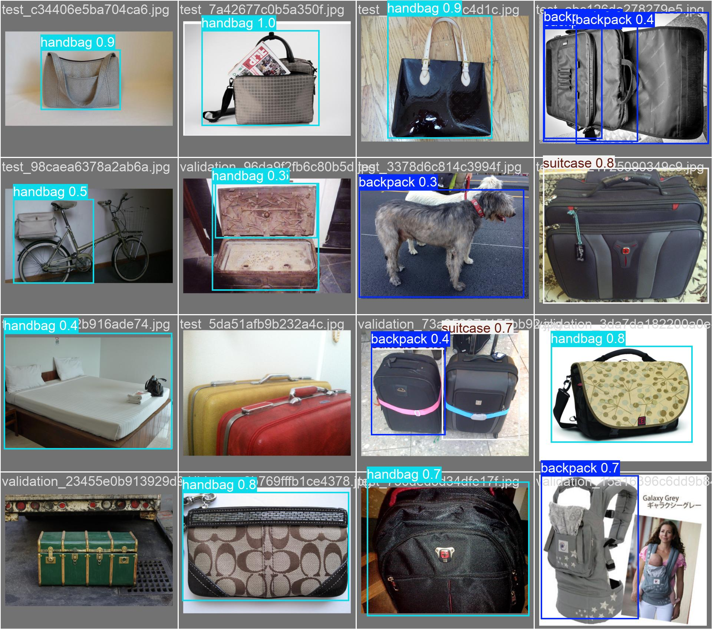
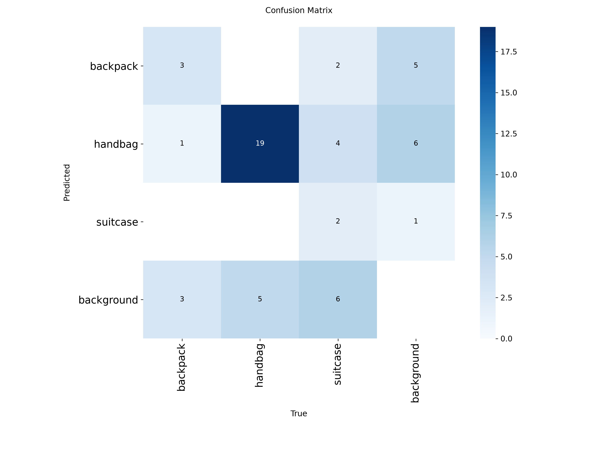

# Failure and error analysis

This analysis uses the YOLO11n fine-tuned held-out test output and the external Pexels carousel. The screenshots are generated artifacts, not curated success-only examples.

| Observed case | Evidence | Probable cause | Practical improvement |
|---|---|---|---|
| Dog predicted as backpack | Held-out prediction montage, row 2 column 3 | Similar dark compact silhouette and straps/harness; too few varied backpack negatives | Add hard-negative animals/people, more worn backpacks, and confidence calibration |
| Bed region predicted as handbag | Montage, row 3 column 1 | Rectangular fabric/handle-like visual texture; background bias | Hard-negative mining and broader contextual scenes |
| Two large red/yellow suitcases missed | Montage, row 3 column 2 | Unusual close crop, low contrast between adjacent bags, and product-photo composition | More adjacent/overlapping suitcase boxes; higher resolution; targeted augmentation |
| Antique trunk missed | Montage, row 4 column 1 | Appearance differs from modern rolling cases in the small training set | Add hard-shell, trunk, soft-shell, and nonstandard luggage styles |
| One of two touching suitcases receives competing backpack/suitcase boxes | Montage, row 3 column 3 | Overlap and visually similar luggage categories; NMS/class boundary ambiguity | More crowded multi-bag labels and class-aware error review |
| Fine-tuned model misses three of four primary-demo crossings | `outputs/demo_output.mp4/json`; baseline 640 run detects 4/4 | Severe domain shift from generic/product images to small moving conveyor luggage; 512 training resolution | Add licensed airport conveyor training sequences with sequence-grouped splits; preserve COCO features with conservative tuning |
| Small/distant rear-belt bags are intermittent | Primary demo | Few pixels, motion, reflections, and detector confidence below threshold | Higher input resolution, temporal detector fusion, camera placement closer to belt |

## Confusion matrix interpretation

At the matrix operating point, the diagonal contains 3 backpacks, 19 handbags, and 2 suitcases. Four true suitcases are labelled handbag, two are labelled backpack, and six are missed as background. There are also background false positives: five backpack, six handbag, and one suitcase. The held-out split is only 45 objects, so each error changes percentages substantially.

The strongest class is handbag (mAP50-95 0.698), consistent with its 293/522 share of the full dataset. Backpack (0.258) and suitcase (0.383) remain data-limited. This class imbalance plus domain mismatch explains why improved aggregate held-out metrics do not automatically translate to better airport-video count accuracy.

## What is and is not claimed

These are detector/classification errors and downstream count symptoms. Formal ID-switch, MOTA, or IDF1 claims are not made because the public videos lack ground-truth trajectories. The tracker observations remain qualitative. A real airport validation would need labelled boxes, track IDs, and crossing events from cameras not used for training or threshold selection.
